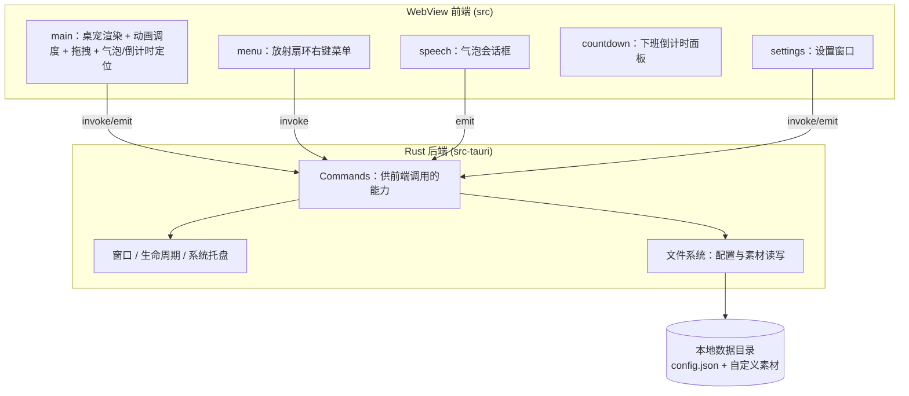
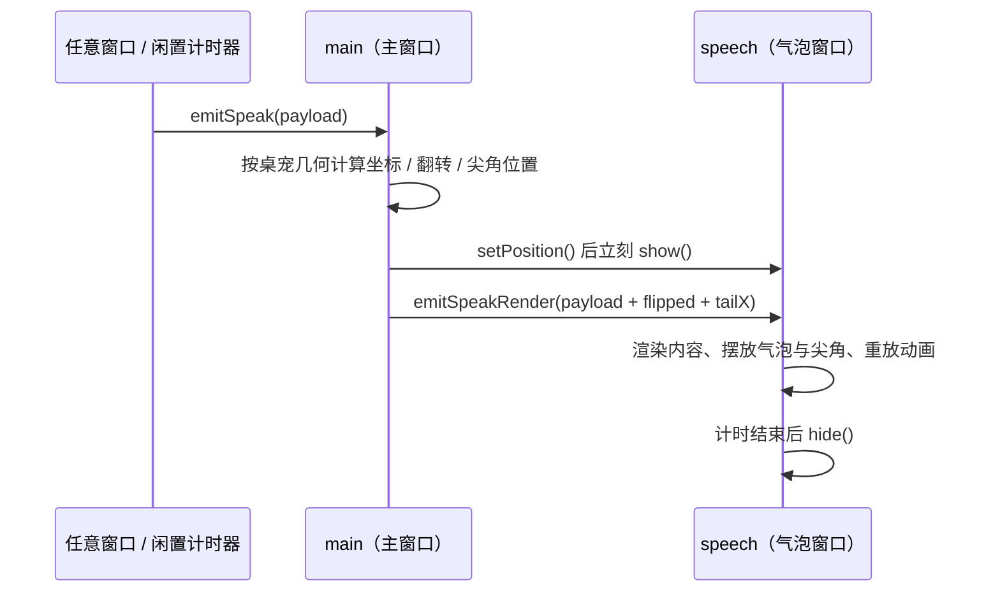
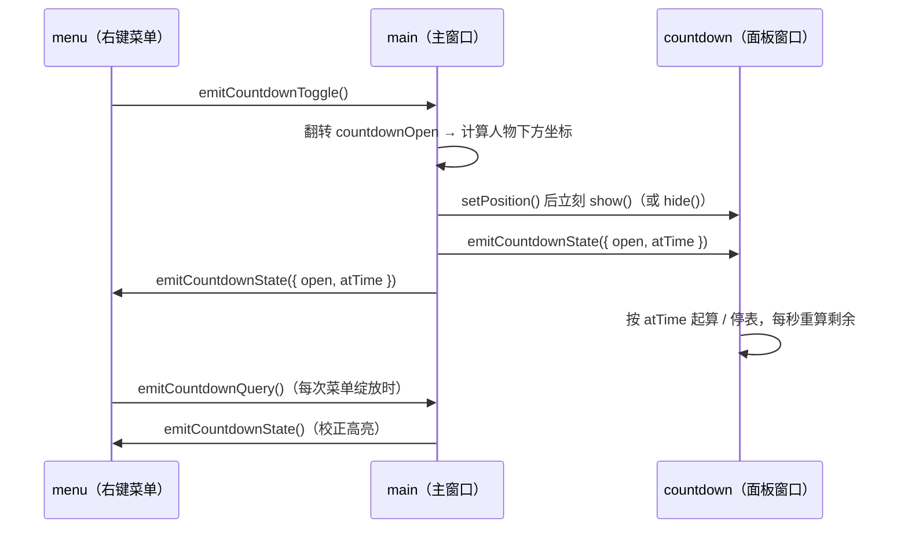
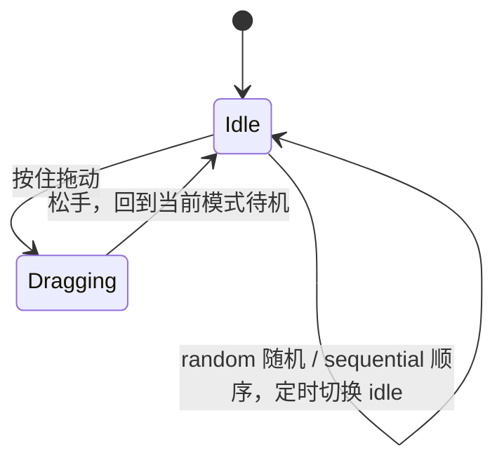

# 02 · 架构与实现

> 本文描述 oneno 桌宠**当前的技术方案与实现**，与代码保持一致。

## 1. 技术选型

| 层       | 选型                   | 说明                                        |
| -------- | ---------------------- | ------------------------------------------- |
| 桌面外壳 | **Tauri v2**           | Rust 后端 + 系统 WebView2，二进制小、内存低 |
| 前端语言 | **TypeScript**         | 类型安全、可维护                            |
| 前端构建 | **Vite**               | 多页面构建，产物精简                        |
| UI 方案  | **原生 DOM（无框架）** | 界面极简，避免运行时与体积开销              |
| 包管理   | npm                    | `npm run dev:desktop` 一键启动开发          |

选型理由：桌宠需长期常驻后台，对体积与内存敏感，故用 Tauri 复用系统 WebView2 而非打包浏览器内核；界面本质是「一张会变的图 + 一个菜单 + 一个气泡 + 一个倒计时面板 + 一个设置页」，DOM 结构极简，引入前端框架只会带来运行时与打包体积负担。

## 2. 总体架构



前端负责表现与交互，Rust 后端负责窗口控制、文件读写与系统集成，两者通过 Tauri 的 `invoke`（命令）与 `emit/listen`（事件）通信。

## 3. 窗口与进程模型

采用**多窗口**模型（Tauri v2 多 WebviewWindow），五个窗口在 `tauri.conf.json` 中静态声明：

| 窗口        | 作用       | 特性                                                                |
| ----------- | ---------- | ------------------------------------------------------------------- |
| `main`      | 桌宠本体   | 透明、无边框、置顶、跳过任务栏、不可缩放；尺寸随宠物大小调整        |
| `menu`      | 右键菜单   | 透明、无边框、置顶、跳过任务栏、480×480、初始隐藏、不聚焦           |
| `speech`    | 气泡会话框 | 透明、无边框、置顶、跳过任务栏、300×170、初始隐藏、不聚焦、点击穿透 |
| `countdown` | 下班倒计时 | 透明、无边框、置顶、跳过任务栏、100×50、初始隐藏、不聚焦、点击穿透  |
| `settings`  | 设置页     | 常规窗口（自绘标题栏）、760×580、可缩放、初始隐藏                   |

选择多窗口而非「单窗口内浮层」的原因：主窗口需紧贴桌宠尺寸以避免大块透明区域拦截桌面点击；菜单、气泡、面板、设置若画在主窗口内会溢出或受尺寸约束。

**权限（`src-tauri/capabilities/`）**：按窗口拆成五份清单（`main` / `menu` / `speech` / `countdown` / `settings`），每份只声明该窗口实际调用的窗口 API，遵循最小授权：

| 窗口        | 额外权限（`core:default` 之外）                                                                      |
| ----------- | ---------------------------------------------------------------------------------------------------- |
| `main`      | `start-dragging`、`set-size`、`set-position`、`center`、`show`、`hide`、`set-focus`、`updater:default` |
| `menu`      | `set-position`、`show`、`hide`、`set-focus`、`unminimize`                                            |
| `speech`    | `set-ignore-cursor-events`、`set-focusable`、`hide`、`show`、`set-position`                          |
| `countdown` | `set-ignore-cursor-events`、`set-focusable`、`hide`                                                  |
| `settings`  | `show`、`hide`、`set-focus`、`minimize`、`unminimize`、`maximize`、`unmaximize`、`dialog:allow-open`、`updater:default` |

> `core:default` 已覆盖全部只读窗口命令（位置 / 尺寸 / 缩放比 / 显示器 / 光标位置 / 可见性等），故不必重复声明。
> ACL 按**发起调用的窗口**校验：主窗口要摆布 `menu` / `speech` / `countdown`，菜单窗口要唤起 `settings`，都需各自持有对应权限。
> 插件只在**前端要调用**其命令时才需要权限条目：`updater` 由设置窗口（检查 / 安装）与主窗口（启动时静默检查）调用，故两份清单都要列；`single-instance` 纯 Rust 侧工作，**不需要**任何 capability。
> `Update` 的 `close()` 走的是 `core:resources:allow-close`，已含在 `core:default` 里，无需额外声明。

### 3.1 单实例：桌宠必须唯一

多窗口模型有个前提 —— **同一时刻只能有一个应用进程**。否则每次双击程序都会新增一整套窗口，桌面上就会叠出好几只桌宠。

由 `tauri-plugin-single-instance` 保证，两条硬性约束：

1. **必须第一个注册**（在 `dialog` / `updater` 之前）。它要在其它插件初始化前就判定「已有实例在跑」，是则把 `argv` 转交给已有实例、让本次进程立刻退出。
2. **回调里不要新建窗口**，只把已有桌宠**显示出来并提到最前**：

```rust
.plugin(tauri_plugin_single_instance::init(|app, _argv, _cwd| {
    focus_existing_pet(app);   // show + unminimize + set_focus + topmost::raise
}))
```

互斥体名字取自 `tauri.conf.json` 的 `identifier`（`com.oneno.pet`），因此**不同安装位置、不同版本的同一应用也互斥** —— 旧版还开着时启动新版，会直接唤起旧版而不是并排跑两个。

`focus_existing_pet` 里额外调 `topmost::raise` 的原因见 §7.2：桌宠各窗口都是 `alwaysOnTop`，而 `set_always_on_top(true)` 在标志位未变化时是**空操作**，提不动同组层级，必须直接 `SetWindowPos(HWND_TOPMOST)`。

## 4. 桌宠主窗口关键配置

```jsonc
{
  "label": "main",
  "url": "index.html",
  "width": 160,
  "height": 160,
  "transparent": true, // 透明背景
  "decorations": false, // 无边框 / 标题栏
  "alwaysOnTop": true, // 始终置顶
  "skipTaskbar": true, // 不占任务栏
  "resizable": false,
  "maximizable": false,
  "minimizable": false,
  "shadow": false,
  "center": true,
}
```

运行时窗口边长 = `petSize + 12`（`WINDOW_PADDING`，给描边与动作留余量）。自定义素材位于 `%APPDATA%`，故 `assetProtocol.scope` 放开 `$APPDATA/**`，配合 `convertFileSrc` 让 WebView 能加载磁盘图片。

## 5. 拖拽与位置

### 5.1 拖拽（`src/pet/DragController.ts`）

- 桌宠元素 `mousedown`（仅左键）记录起点，位移超过 **5px** 阈值才调用窗口的 `startDragging()`，此后由系统接管本次拖动。
- 位移小于阈值判为点击（当前不绑定任何动作）。
- **拖拽结束只由真实鼠标释放判定，不依赖计时器**，三重保障：
  1. window `mouseup`；
  2. 原生拖动吞掉 `mouseup` 时，靠拖拽中收到的 `mousemove` 检测左键已松开（`buttons & 1 === 0`）补收尾；
  3. 极端情况下由下一次 `mousedown` 兜底复位。

  这样「切换造型的时间」永远不会影响一次拖拽，拖拽造型必定保持到真正松手。

### 5.2 位置持久化（`src/main.ts`）

- 监听 `onMoved`，防抖 400ms 后写盘。
- **拖拽过程中只记录坐标、绝不 clamp**（避免定时触发挪动窗口打断拖拽）；松手后再统一收拢。
- `clampToWorkArea()`：把窗口收进当前显示器的 workArea（屏幕去掉任务栏后的区域），避免被任务栏遮挡。
- `restorePosition()`：启动时校验记忆坐标是否仍落在某个显示器范围内（含 8px 容差），越界则回到屏幕中央。

## 6. 右键菜单（放射扇环）

采用自定义 HTML/SVG 菜单（非系统原生菜单），以呈现头像与圆润风格。

### 6.1 几何模型（`src/menu.ts`）

窗口 480×480，中心 (240, 240) 即头像圆心；菜单是绕头像的**扇环带**，用极坐标生成 SVG 环形扇面路径。

| 参数          | 值         | 说明                                 |
| ------------- | ---------- | ------------------------------------ |
| `L1_IN/OUT`   | 30 / 60    | 一级扇环内外半径                     |
| `L2_IN/OUT`   | 70 / 100   | 二级扇环内外半径                     |
| `L1_SPAN/GAP` | 36° / 7°   | 一级每项角宽与相邻间隙               |
| `L2_SPAN/GAP` | 24° / 6°   | 二级每项角宽与相邻间隙               |
| 图标 / 标签   | 18 / 16 px | 图标居中于扇面质心，标签浮于外弧之外 |
| 朝向          | 180° / 0°  | 默认朝左；贴近屏幕左缘时翻向右       |

- 一级项整体居中于当前朝向；二级项以被点父项的角度为中心、在更大半径展开。
- 每项以 `transform-origin` 从窗口中心（一级）或父项质心（二级）缩放绽放，并按 `STAGGER = 0.04s` 依次入场。
- 菜单项由 `MENU` 数组数据驱动：带 `children` 即成为可展开父项，支持任意层级。
- 每项 id 必须唯一（展开时靠 id 匹配高亮父项、淡出其余项）。

### 6.2 定位与关闭

- 主窗口收到 `contextmenu` 后计算光标屏幕坐标，把菜单窗口**中心对准光标**（头像正对光标），纵向夹住头像以保证扇环不被屏幕上下缘裁掉。
- **朝向在 `show()` 之前定好**：主窗口按光标横坐标与所在显示器左缘算出朝向，先通过 `oneno-menu-prepare` 告知菜单窗口，让它在窗口可见前就按最终朝向重建扇面并归零 —— 显示后不再重排，从根上消除「闪一下再重显」。
- 关闭方式：失焦、点击菜单外空白、按 Esc、点击中心头像；Esc 与点击头像为「先收二级，再关菜单」的两段式。

## 7. 气泡会话框（`speech` 窗口）

独立窗口渲染气泡，主窗口负责定位——因为跨窗口查询主窗口几何在实测中不稳定。



- **关键时序**：`setPosition()` 后**立刻** `show()`——位置在 show 那一刻才提交。隐藏态或常驻可见后再 `setPosition()` 都不生效（气泡会停在左上角）。
- **定位规则**（`computeSpeechPlacement`）：气泡默认贴桌宠头顶，头顶放不下（超出工作区上缘）则翻到下方（`flipped`，尖角朝上）；横向夹进工作区，并把桌宠中心相对气泡窗口左缘的位置作为 `tailX` 传给气泡窗口，由它横移尖角（避开圆角）使尖角始终指向桌宠。
- **点击穿透**：`setIgnoreCursorEvents(true)`，气泡不拦截鼠标。
- **手动关闭模式**：提醒气泡可选「手动关闭」。此时整窗仍保持穿透，仅在光标落入气泡矩形时才临时取消穿透（100ms 轮询 + 4px 外扩容差），既保证右下角确认按钮可点，又不会在气泡之外的区域形成挡住桌面的「死区」。关闭后通过 `oneno-speak-closed` 通知主窗口解除等待态；等待期间拒绝一切新的说话，避免被碎碎念或其它提醒覆盖。
- **自动消失**：按文本长度估算 `2400 + 字符数 × 130`，夹在 3 ~ 8 秒；拖拽开始、桌宠隐藏 / 遮挡时立即收起。
- **闲置碎碎念**：`startIdleChatter` 每隔 45 ~ 90 秒随机挑一句预设短句（不与上一句重复）直接调用 `showSpeech`；拖拽中或窗口隐藏时跳过。

## 7.1 下班倒计时面板（`countdown` 窗口）

一个**与气泡互相独立**的窗口：气泡负责「说一句话」，面板负责「持续显示一个数」——两者的生命周期、定位规则与交互方式都不同，故不复用同一窗口。



- **状态归属**：`countdownOpen` 与目标时间由常驻的 `main` 窗口持有。菜单窗口只发 `toggle` / `query`，面板窗口只渲染——避免多处各自维护状态导致不一致。
- **定位**（`computeCountdownPlacement`）：**优先贴在人物下方**；下方放不下（桌宠贴近工作区底部）则**翻到人物上方**，与气泡同一套「优先 / 翻转」思路；上下都放不下时选剩余空间更大的一侧。横向**面板中轴始终对齐人物中轴**。
  注意桌宠窗口比素材大 `WINDOW_PADDING`（素材居中），故窗口下缘本身已在人物脚下 `WINDOW_PADDING/2` 处——`COUNTDOWN_GAP` 是在此基础上再加的间距。
  卡片在面板窗口内**贴顶**（`.cd` 用 `align-items: flex-start`），使「窗口上缘 == 卡片上缘」，定位时无需再扣窗口内的透明余量。
- ⚠️ **面板定位必须用窗口的实际 `outerSize()`，不能用声明尺寸**：Windows 会把过小的窗口撑到系统最小尺寸（实测声明 100 宽、实际约 136）。卡片在窗口内居中，若按声明宽度居中，卡片会整体偏右 `(实际宽 - 声明宽) / 2`（= 18px），表现为「中轴没对齐」。`COUNTDOWN_W/H` 仅作读不到实际尺寸时的兜底。
- **贴屏幕左右边缘时保住中轴**：横向夹取以**卡片**为准而非窗口——窗口左右各有一段透明余量（卡片在窗口内居中），允许窗口贴边时探出这一段（`COUNTDOWN_CARD_W` 取卡片宽度上界，宁大勿小），卡片仍完整可见，中轴因此不会被夹偏。
- **显示时序**：与气泡完全一致——先 `setPosition()` 再立刻 `show()`（位置在 `show()` 那一刻才提交）。
- **计时**：`setInterval(1000)`，每次以 `Date.now()` **重算**剩余而非累减，避免长时间运行后漂移；数字用 `font-variant-numeric: tabular-nums` 等宽，防止每秒跳动时左右抖动。
- **到点门控**：到点后置 `done` 并显示「下班啦」，此后每 tick 直接返回；只有当 `sameLocalDay(now, target)` 为假（已跨到新的一天）才重新按明天的 `atTime` 起算。若不门控，到点后会立刻又变回倒计时。
- **日期计算**：比较用本地 `getFullYear/Month/Date`；跨天顺延复用 `reminders.ts` 导出的 `nextDailyAt`（内部用 `setDate(+1)`，避免夏令时整点偏移）。
- **跟随与联动**：`win.onMoved` 里用 `requestAnimationFrame` 节流同步面板位置；设置页改了下班时间时主窗口重新广播 `state`；桌宠被隐藏 / 遮挡时面板一并收起并广播 `open:false`。
- **交互**：面板常驻 `setIgnoreCursorEvents(true)` + `setFocusable(false)`，全程点击穿透、不抢焦点，开合只由右键菜单控制。
- **不持久化**：开合状态不写入 `config.json`，重启后默认关闭。

## 7.2 窗口层级：气泡永远压着倒计时面板

面板翻到人物上方时会与气泡（会话框）在空间上重叠，此时**必须保证气泡在上层**——手动关闭模式的气泡右下角带确认按钮，被盖住就点不到了。

- **不能用 `setAlwaysOnTop(true)` 来「再提一层」**：tauri 的 `set_always_on_top` 内部走 `apply_diff`，**标志位没变化时直接 return**（见 `tao/src/platform_impl/windows/window_state.rs`），所以对已经是置顶的窗口再调一次是空操作。
- **实现**：Rust 自定义命令 `raise_window(label)` 直接调 Win32 `SetWindowPos(hwnd, HWND_TOPMOST, …, SWP_NOMOVE | SWP_NOSIZE | SWP_NOACTIVATE | SWP_ASYNCWINDOWPOS)`。重复调用会把窗口重新排到**置顶组首位**，从而压住其它置顶窗口。用 `extern "system"` 直接声明 FFI，**不引入 `windows` crate 依赖**（否则版本还要跟 tauri 内部对齐）。
- **两个调用点**（缺一不可，因为「显示窗口会把它排到置顶组前面」）：
  1. `showSpeech()` 显示气泡后 → `raiseWindow("speech")`；
  2. `showCountdown()` 显示面板后，若气泡当前可见（`speech.isVisible()`）→ 再次 `raiseWindow("speech")`。
- `SWP_NOACTIVATE` 保证提升层级**不抢焦点**，符合桌宠「不打扰用户」的定位。

## 8. 设置窗口

- 独立 `settings` 窗口（单例）：关闭按钮为隐藏而非销毁，重复打开时显示并聚焦。
- 自绘标题栏（无边框窗口），支持最小化 / 最大化还原 / 关闭，并随窗口尺寸同步最大化图标状态。
- 左侧导航六个页面：总览 / 宠物设置 / 素材库 / 软件 / 提醒 / 关于。
- 上传通过 Tauri `dialog` 打开文件选择器，选中后由后端命令把文件复制进数据目录并更新素材清单。
- 所有改动即时落盘（`save_config`）并广播 `oneno-config-changed`，桌宠窗口据此热更新，无需重启。
- 版本更新流程的状态机见 `docs/04-更新与发版.md`。

## 8.1 定时提醒（`src/core/reminders.ts`）

提醒调度器跑在常驻的主窗口里，与闲置碎碎念同层，由 `createReminderScheduler(fire)` 创建。

- **轮询而非长定时器**：每 15 秒 tick 一次，用「墙钟时间比较」判断是否到期。好处是休眠唤醒后首个 tick 即可补触发，且配置热更新只需重算 `nextAt`，无需管理一堆定时器句柄。
- **两类触发**：间隔型（久坐 / 喝水）为 `now + intervalMs`；每日定时型（下班）由 `nextDailyAt` 算出下一个 `HH:MM`（用 `setDate` 顺延而非 `+86400000`，避免整点偏移）。
- **配置指纹**：只有影响触发时刻的字段（`enabled` / `intervalMs` / `atTime`）变化才重算倒计时——改文案或关闭方式不会把倒计时重置掉。
- **排队而非覆盖**：同一 tick 内多个提醒到期时只弹第一个（按到期时间升序，并列按 `offwork > water > sit` 优先级），其余保持到期态留待下个 tick，天然形成排队。
- **弹不出就重试**：`fire` 返回 `false`（桌宠被隐藏，或正有未关闭的手动会话框）时不推进 `nextAt`，下个 tick 重试。

## 9. 动画调度（`AnimationScheduler`）

调度器决定「何时播放哪个动作」，是桌宠「活起来」的核心。

- **输入**：当前角色的素材池（内置 + 自定义），按类别分组（`idle` / `drag`）。
- **动作模式**：由 `config.behaviorMode` 决定待机时如何展示造型：
  - **单一动作（`single`）**：固定展示 `config.singleActionIds[角色]` 指定的造型，不启动定时器；指定造型被删除或隐藏时回退到候选池第一个可用造型。
  - **随机轮播（`random`）**：用固定间隔定时器从 `idle` 池随机取一个动作，避免连续重复。
  - **顺序轮播（`sequential`）**：用固定间隔定时器按顺序循环播放 `idle` 池。
- **切换频率**：由 `config.idleIntervalMs` 决定（默认 60s，可在设置中按秒 / 分 / 小时调整，范围 1 秒 ~ 24 小时）；`single` 模式不涉及计时。
- **拖拽驱动**：拖动时从 `drag` 池随机取一个造型并保持整个拖拽过程，松手后回到待机（`single` 回到指定造型，`random` / `sequential` 回到拖拽前的造型并继续排程）。
- **可见性优化**：窗口隐藏 / 遮挡时 `pause()` 清定时器，恢复时 `resume()` 重新排程。
- **播放方式**：双缓冲两个 `` 交替交叉淡入；启动时预载当前角色全部造型，使切换与拖拽的淡入即时、无加载停顿。
- **容错**：加载失败的素材记入 `badIds` 临时剔除；空池时回退（指定类别 → `idle` → 全部），保证任何角色都有形象可显示。



## 10. 素材管理与存储

### 10.1 内置素材

- 随仓库放在 `public/assets/<角色>/`，按角色分子目录存放，由 `src/core/characters.ts` 静态声明为可播放条目；Vite 会把 `public/` 原样发布到根路径，前端以 `/assets/<角色>/<文件>` 引用。
- **不扫描目录、不写 manifest**。
- 删除内置素材 = 记入 `config.hiddenBuiltins`（软隐藏），文件保留，恢复默认可复原。

### 10.2 自定义素材

- 数据目录由 Rust `app_data_dir()` 定位，即 `%APPDATA%/com.oneno.pet/`：
  - `assets/{yier,bubu}/{id}.{ext}`：自定义素材副本
  - `assets/manifest.json`：自定义素材索引（`id / character / category / path`）
  - `config.json`：应用配置
- **上传流程**：`dialog.open` 选文件 → `add_custom_asset` 校验扩展名并拷贝到对应角色目录 → 写入 `manifest.json` → 前端广播 `oneno-assets-changed` 刷新播放池。
- **加载**：`list_custom_assets` 返回磁盘绝对路径（跳过已丢失的文件，并把对应条目从 `manifest.json` 中摘除，实现清单自愈），前端经 `convertFileSrc` 转为 `asset:` 地址加载。
- **删除**：`remove_custom_asset` 删除磁盘文件并更新 manifest。
- **删除约束**：前端保证每个类别至少保留一个素材，删到只剩一个时拒绝。

## 11. 配置持久化

- 配置文件：数据目录下 `config.json`。
- **实现**：不引入 `tauri-plugin-store` / `-fs`，全部由 Rust 自定义命令 `load_config` / `save_config` 用 `std::fs` 读写 JSON，规避插件权限配置、保持少依赖。
- 前端读取后经 `normalize()` 与 `DEFAULT_CONFIG` 合并，并做夹取与校验：
  - `petSize` 夹取 20 ~ 200，`petOpacity` 夹取 0.3 ~ 1，`idleIntervalMs` 夹取 1s ~ 24h；
  - `avatarIds` / `hiddenBuiltins` / `singleActionIds` 重建为独立对象（不共享默认值引用），非法值回退 `null` / 空数组；
  - 兼容旧版字段：`autoRotate`（布尔）迁移为 `behaviorMode`，`idleMinMs` / `idleMaxMs` 取中位数迁移为 `idleIntervalMs`，迁移后旧字段被丢弃。

## 12. 目录结构

```
oneno-pet/
├── index.html              # 桌宠主窗口页面
├── menu.html               # 右键菜单窗口页面
├── speech.html             # 气泡会话框窗口页面
├── countdown.html          # 下班倒计时面板窗口页面
├── settings.html           # 设置窗口页面
├── package.json
├── tsconfig.json
├── vite.config.ts          # 多页面构建（五个 html 入口）+ 固定端口 1420
├── CHANGELOG.md            # 更新日志；发版说明由 CI 抽对应小节填进 Release
├── .github/workflows/
│   ├── ci.yml              # 日常：push / PR 跑类型检查 + 构建 + 版本号一致性
│   └── release.yml         # 推送 v* 标签触发：构建 + 签名 + 建 Release 草稿
├── scripts/                # 版本号与发布辅助脚本（Node ESM）
│   ├── version-files.mjs   # 版本号定位 / 读写 / 一致性校验（下面两个脚本共用）
│   ├── set-version.mjs     # 一条命令改完四处版本号
│   ├── sync-version.mjs    # 把 tauri.conf.json 的版本反写到其余文件
│   ├── build-desktop.mjs   # 本地打包（自动注入签名私钥）
│   ├── wait-release.mjs    # 盯 tag 触发的 CI 构建
│   └── changelog-section.mjs # 从 CHANGELOG.md 抽指定版本的发版说明
├── src/                    # 前端（原生 TS）
│   ├── main.ts             # 主窗口：渲染 / 拖拽 / 位置 / 气泡与面板定位 / 闲置碎碎念 / 启动时静默查更新
│   ├── menu.ts             # 菜单窗口：放射扇环生成与交互
│   ├── speech.ts           # 气泡窗口：内容渲染 / 尖角摆放 / 自动收起 / 手动关闭命中检测
│   ├── countdown.ts        # 倒计时面板：每秒刷新 / 到点态 / 停表省电
│   ├── settings.ts         # 设置窗口：六个页面的全部交互
│   ├── types.ts            # 共享类型与常量（含跨窗口事件名）
│   ├── pet/
│   │   ├── PetRenderer.ts        # 双缓冲渲染 + 预载
│   │   ├── AnimationScheduler.ts # 动画调度（三种模式 + 拖拽）
│   │   └── DragController.ts     # 拖拽与点击判定
│   ├── core/
│   │   ├── characters.ts         # 内置角色与素材登记
│   │   ├── config.ts             # 配置读写与归一化
│   │   ├── assetManager.ts       # 素材池 / 清单 / 头像解析
│   │   ├── reminders.ts          # 定时提醒调度器（tick 轮询）
│   │   ├── updater.ts            # 更新检查的公共部分（超时 / 资源释放 / 节流）
│   │   └── bus.ts                # 跨窗口事件封装
│   └── styles/             # pet.css / menu.css / speech.css / countdown.css / settings.css
├── public/
│   └── assets/             # 内置素材（按角色分子目录）+ icon.png
├── src-tauri/              # Rust 后端
│   ├── src/{main.rs, lib.rs}     # lib.rs 内含全部 #[tauri::command] 与系统托盘
│   ├── capabilities/             # 按窗口拆分的最小授权清单（main / menu / speech / countdown / settings）
│   ├── icons/                    # 由 `npm run icons` 生成
│   ├── Cargo.toml
│   ├── build.rs
│   └── tauri.conf.json
└── docs/                   # 本说明文档集
```

## 13. 依赖清单

**Rust（Cargo）**

| 依赖                           | 用途                                                                                  |
| ------------------------------ | ------------------------------------------------------------------------------------- |
| `tauri` (v2)                   | 核心框架；启用 `protocol-asset`（加载磁盘图片）与 `tray-icon`（系统托盘）             |
| `tauri-plugin-single-instance` | 保证桌宠唯一：重复启动时第二个进程自行退出，并把参数转交已有实例（见 §3.1）           |
| `tauri-plugin-dialog`          | 文件选择对话框                                                                        |
| `tauri-plugin-updater`         | 应用内检查更新：拉取 `latest.json`、下载、minisign 验签、调 NSIS 静默安装             |
| `serde` / `serde_json`         | 配置与清单序列化                                                                      |
| `tauri-build`                  | 构建期代码生成（build-dep）                                                           |

> 文件读写全部用 `std::fs` 在自定义命令里完成，**不引入** `tauri-plugin-fs` / `-store`；开机自启**不引入** `tauri-plugin-autostart`，改用自定义命令调 `reg.exe` 读写 `HKCU\Software\Microsoft\Windows\CurrentVersion\Run` 实现（零依赖）。
>
> **不引入 `tauri-plugin-process`**：Windows 上 `tauri-plugin-updater` 的 `install_inner` 在启动安装程序后直接 `std::process::exit(0)`（源码 `updater.rs` 中该分支以 exit 收尾），由 NSIS 安装程序负责把应用重新拉起来。因此 `downloadAndInstall()` 的 Promise 正常路径根本不会 resolve，前端既拿不到控制权、也没有 `relaunch()` 可调 —— 引入它只多一个依赖和一条 `process:allow-restart` 权限。

**前端（npm）**

| 依赖                         | 用途                                        |
| ---------------------------- | ------------------------------------------- |
| `@tauri-apps/api`            | 前端调用窗口 / 事件 / 路径 / asset 等       |
| `@tauri-apps/plugin-dialog`  | dialog 插件的 JS 绑定                       |
| `@tauri-apps/plugin-updater` | updater 插件的 JS 绑定（检查 / 下载 / 安装） |
| `@tauri-apps/cli`            | 开发与打包 CLI（dev 依赖）                  |
| `typescript` / `vite` / `@types/node` | 语言与构建（dev 依赖）             |

> 原则：非上表所列一律不引入；新增依赖需说明必要性。

## 14. 前后端通信

**Commands（前端 `invoke` 后端，见 `src-tauri/src/lib.rs`）**

| 命令                                             | 作用                                      |
| ------------------------------------------------ | ----------------------------------------- |
| `quit()`                                         | 退出应用                                  |
| `load_config()` / `save_config(config)`          | 读写 `config.json`（不存在时返回 `null`） |
| `list_custom_assets()`                           | 列出全部自定义素材，按角色分组            |
| `add_custom_asset(character, category, srcPath)` | 校验并拷贝文件到数据目录 + 登记           |
| `remove_custom_asset(id)`                        | 删除自定义素材（磁盘文件 + 登记记录）     |
| `get_autostart()` / `set_autostart(enabled)`     | 查询 / 设置开机自启（Windows 注册表）     |
| `raise_window(label)`                            | 把指定窗口提到置顶组最前（见 §7.2）       |
| `open_url(url)`                                  | 用系统默认浏览器打开 https 链接（更新失败时跳转发布页兜底） |

> 注：`invoke` 的 JS 参数用 camelCase（如 `srcPath`），Tauri 自动映射到 Rust 的 snake_case（`src_path`）。窗口操作（拖拽、定位、显隐、聚焦、关闭、点击穿透）直接用 `@tauri-apps/api` 的 window API 完成，由 `capabilities/` 下按窗口拆分的 5 份清单授权，无需自定义命令。

**Events（`bus.ts` 封装的全局 emit/listen，广播到所有窗口）**

| 事件名                   | 触发时机                                 | 载荷                                     |
| ------------------------ | ---------------------------------------- | ---------------------------------------- |
| `oneno-config-changed`   | 配置变更（切角色 / 改尺寸等）            | 完整 `AppConfig`                         |
| `oneno-assets-changed`   | 某角色自定义素材增删                     | `{ character }`                          |
| `oneno-speak`            | 请求弹出气泡（任意窗口 → 主窗口）        | `SpeakPayload`（文本 / 图标 / 时长）     |
| `oneno-speak-render`     | 主窗口定位完毕，通知气泡渲染             | `SpeakRenderPayload`（含翻转与尖角位置） |
| `oneno-speak-hide`       | 立即收起气泡                             | 无                                       |
| `oneno-speak-closed`     | 气泡已收起（气泡窗口 → 主窗口）          | 无                                       |
| `oneno-countdown-toggle` | 请求切换倒计时面板显隐（菜单 → 主窗口）  | 无                                       |
| `oneno-countdown-state`  | 广播面板状态（主窗口 → 菜单 / 面板）     | `CountdownState`（`open` + `atTime`）    |
| `oneno-countdown-query`  | 询问面板当前状态（菜单 → 主窗口）        | 无                                       |
| `oneno-menu-prepare`     | 弹出菜单前预告知扇形朝向（主窗口 → 菜单）| `MenuPreparePayload`（`side`）           |

> 事件名仅用字母 / 数字 / 连字符，符合 Tauri 事件名规则。

## 15. 性能与体积优化

- 前端零框架、单文件媒体渲染，DOM 极简。
- Rust release 构建开启（`Cargo.toml`）：`opt-level = "z"`、`lto = true`、`codegen-units = 1`、`panic = "abort"`、`strip = true`、`incremental = false`。
- 隐藏 / 遮挡时暂停定时器与动画，降低空闲占用。
- 素材按需加载 + 启动预载，避免一次性载入全部大图造成卡顿。
- 气泡与倒计时面板点击穿透，不参与鼠标事件分发。
- 复用系统 WebView2，不打包浏览器内核。

## 16. 打包配置

- 打包目标：NSIS 安装包（`bundle.targets = ["nsis"]`）。
- 图标：`bundle.icon` 已配置，由 `npm run icons`（`tauri icon`）从 `public/assets/icon.png` 生成到 `src-tauri/icons/`。
- WebView2：`webviewInstallMode = downloadBootstrapper`，缺失环境时引导下载。
- 构建命令：`npm run build:desktop`（内部调 `tauri build`，并自动注入升级签名私钥；不要直接跑 `npm run tauri build`），产物位于 `src-tauri/target/release/bundle/nsis/`。
- 升级签名：`bundle.createUpdaterArtifacts = true`，安装包旁会额外生成 `.sig` 与 `latest.json`，供应用内检查更新使用（详见 `docs/04-更新与发版.md`）。
- 个人自用、无代码签名，首次运行可能有 SmartScreen 提示。
