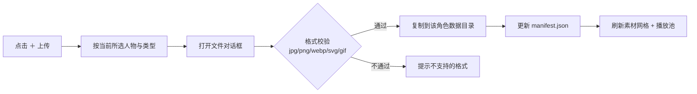

# 03 · 交互与资源规范

> 本文描述 oneno 桌宠**当前实现的交互流程、视觉规范与素材规范**。

## 1. 设计原则

- **可爱圆润风**：粗描边、圆角、柔和配色，贴合「一二 / 布布」小熊形象。
- **轻打扰**：桌宠不抢焦点、不占任务栏；气泡与倒计时面板点击穿透，交互即点即走。
- **一致性**：菜单、气泡、面板、设置窗口沿用同一套圆角与配色变量。

## 2. 视觉风格规范

| 元素          | 规范                                                                                  |
| ------------- | ------------------------------------------------------------------------------------- |
| 描边          | 深棕 `#4A3B33`，粗线条（2–3px 视觉）                                                  |
| 圆角          | 菜单 / 气泡 12–16px，倒计时卡片 9px                                                   |
| 投影          | 暖色分层投影，统一用墨棕低透明度（`rgba(74, 59, 51, …)`），不用灰调「通用卡片阴影」    |
| 强调 / 按钮   | 圆角胶囊，hover 轻微放大或提亮                                                        |
| 字体          | 系统圆体优先（「微软雅黑」/ PingFang SC / system-ui）                                  |
| 动效          | 入场用轻微回弹曲线（`cubic-bezier(0.34, 1.56, 0.64, 1)`），尊重 `prefers-reduced-motion` |

## 3. 配色规范

UI 配色取自 `src/styles/settings.css` 的 `:root` 自定义属性（`menu.css` 等沿用同一组值）：

| 用途                | 变量             | 色值      |
| ------------------- | ---------------- | --------- |
| 页面 / 菜单 / 气泡底 | `--bg`           | `#FFFDF9` |
| 卡片                | `--card`         | `#FFFFFF` |
| 侧栏                | `--sidebar`      | `#FBF6EF` |
| 浅棕底（hover / 选中）| `--tint`        | `#FBF3EC` |
| 主文字 / 描边       | `--text`         | `#4A3B33` |
| 次要文字            | `--muted`        | `#8A7A6E` |
| 分隔线              | `--line`         | `#E7E0D6` |
| 强调（布布主色）    | `--accent`       | `#DDA68D` |
| 强调深色            | `--accent-dark`  | `#8A5A3B` |
| 危险（退出项）      | `--danger`       | `#C0553B` |

## 4. 桌宠主体交互

| 触发                               | 行为                                                            |
| ---------------------------------- | --------------------------------------------------------------- |
| 左键单击                           | 无动作绑定                                                      |
| 左键按住拖动                       | 移动窗口位置（位移超过 5px 判定为拖拽），同时切换为「拖拽」造型 |
| 左键松手                           | 拖拽造型结束，回到当前动作模式的待机造型，并持久化位置          |
| 右键                               | 在光标处弹出放射扇环菜单                                        |
| 系统右键菜单 / 文本选择 / 图片拖拽 | 全部屏蔽                                                        |

- **命中区域**：窗口紧贴桌宠尺寸（`petSize + 12`），减少透明留白对桌面点击的拦截。
- **点击 vs 拖拽判定**：`mousedown` 记录起点，位移超过 5px 才触发原生拖拽，否则视为点击。
- **拖拽期间**：待机轮播计时暂停，拖拽造型保持不变；松手后才恢复。

## 5. 右键菜单（放射扇环）

菜单是一个 480×480 的透明窗口，中心正对光标处的桌宠位置，整体呈绕头像的扇环带。

```
            ╭───╮
         ╱  ⚙设置  ╲        ← 一级扇环（半径 30–60）
        │🕐下班倒计时│       ← 开关型项，开启时以主强调色高亮
        │  (头像)   │       ← 中心圆形头像
         ╲  ⏻退出  ╱        ← 危险项用红色描边
            ╰───╯
```

| 部分       | 交互                                                                   |
| ---------- | ---------------------------------------------------------------------- |
| 中心头像   | 圆形头像 + 内描边；点击时：有二级展开则先收起二级，否则关闭菜单        |
| 一级扇面项 | hover 提亮扇面并浮现外侧标签；点击执行动作或展开二级                   |
| 开关型项   | 「下班倒计时」为开关：点击切换面板显隐；开启时该项以主强调色实心高亮（类名 `node--on`） |
| 二级扇面项 | 点击带 `children` 的父项后，在其外侧更大半径展开，父项高亮、其余项淡出 |
| 空白区域   | 点击关闭菜单                                                           |

- **朝向自适应**：默认扇形朝左；窗口贴近所在显示器左缘时自动翻向右，避免内容出屏。朝向在窗口显示前就定好，不出现「闪一下再重显」。
- **入场动画**：头像缩放绽放 → 扇面按 0.04s 间隔依次浮现（从窗口中心缩放生长）。
- **关闭方式**：失焦、点击空白、按 Esc、点击中心头像；Esc / 点击头像为「先收二级，再关菜单」。
- **危险项**：退出使用危险色（`#C0553B`），hover 时扇面转为浅红。

## 6. 气泡会话框

桌宠「说话」时，从头顶冒出一个奶白气泡（独立窗口，点击穿透，不抢焦点）。

```
        ╭──────────────────────╮
        │  🕐  记得喝口水～    │   ← 图标可选（提醒类）
        ╰──────────┬───────────╯
                   ▽              ← 尖角始终指向桌宠
                 (桌宠)
```

| 项       | 规范                                                                         |
| -------- | ---------------------------------------------------------------------------- |
| 位置     | 默认贴桌宠头顶（尖角与桌宠间距 3px）；头顶空间不足时翻到桌宠下方（尖角朝上） |
| 尖角     | 横向跟随桌宠：气泡被屏幕边缘夹住时，尖角在气泡内横移，始终指向桌宠           |
| 边距     | 气泡距窗口左右缘最少 6px，尖角距气泡两端最少 16px（避开圆角）                |
| 入场     | 从尖角处向上「生长」弹出（`transform-origin` 定在尖角）                      |
| 时长     | 按文本长度估算 3 ~ 8 秒后自动收起                                            |
| 提前收起 | 拖拽桌宠、桌宠隐藏 / 被遮挡时立即收起                                        |
| 点击     | 点击穿透，不拦截任何鼠标操作                                                 |

**闲置碎碎念**：桌宠空闲时每隔 45 ~ 90 秒随机说一句预设短句（7 句暖色系短句，不与上一句重复）；拖拽中或窗口隐藏时跳过，避免打扰操作。

**手动关闭模式（提醒类）**：提醒气泡可选「手动关闭」——此时不自动收起，气泡右下角出现确认按钮（文案随提醒语义，如「知道了」/「好的」）。窗口整块仍保持点击穿透，只在光标进入气泡矩形时才临时取消穿透（100ms 轮询 + 4px 外扩容差），既保证按钮可点，又不会在气泡之外的区域形成挡住桌面的「死区」。点击确认按钮后收起，并通过 `oneno-speak-closed` 通知主窗口解除等待态。

## 7. 下班倒计时面板

与气泡同源的奶白卡片，内容为「小标签 + 大号倒计时」两行，不显示目标下班时间。**无尖角**——面板挂在人物下方（或上方），不指向人物，也不需要指向。

默认贴在人物下方：

```
             (桌宠窗口 160×160)
      ┌─────────────────────────┐
      │                         │
      │         (人物)          │
      │                         │
      └─────────────────────────┘
                 ↕ 4px（窗口下缘已在人物脚下 6px 处）
      ┌─────────────────────────┐
      │   ╭─────────────╮       │  ← 面板窗口 100×50
      │   │  距离下班   │       │     卡片贴窗口上缘
      │   │  02:34:15   │       │
      │   ╰─────────────╯       │
      └─────────────────────────┘
         ↑ 面板中轴 == 人物中轴
```

桌宠贴近工作区底部（下方放不下）时**翻到人物上方**——否则只能上提，会压在人物身上：

```
      ┌─────────────────────────┐
      │   ╭─────────────╮       │  ← 翻到上方；气泡若在显示，
      │   │  距离下班   │       │     层级仍在面板之上
      │   │  02:34:15   │       │
      │   ╰─────────────╯       │
      └─────────────────────────┘
                 ↕ 4px
      ┌─────────────────────────┐
      │         (人物)          │
      │                         │
      └─────────────────────────┘
```

| 项     | 规范                                                                 |
| ------ | -------------------------------------------------------------------- |
| 尺寸   | 窗口 100×50（卡片 42 高 + 底部 8px 投影余量）；卡片最小宽 76，圆角 9px，投影与气泡同源 |
| 尖角   | 无（挂在人物下方 / 上方，不需要指向）                                 |
| 数字   | `font-variant-numeric: tabular-nums` 等宽，避免每秒跳动时左右抖动     |
| 入场   | 从卡片上缘向下缩放展开（`transform-origin: center top`；卡片贴窗口上缘，故不做向上位移，否则顶边会被窗口裁掉） |
| 到点态 | 整卡转为暖色强调（`--accent` 底 + 反白文字），文案变为「今天辛苦啦 / 下班啦」，保持显示 |
| 交互   | 全程点击穿透、不抢焦点；开合由右键菜单项控制，面板本身不响应鼠标       |
| 位置   | **优先下方**；下方放不下则**翻到上方**；上下都放不下时选空间更大的一侧。**横向中轴始终与人物中轴对齐** |
| 层级   | 翻到上方与气泡重叠时，**气泡在上层**（见 `docs/02` §7.2），保证手动气泡的确认按钮可点 |

菜单项「下班倒计时」在面板开启时以主强调色实心扇面 + 白色图标高亮（类名 `node--on`），让用户下次打开菜单时一眼看到当前状态。

## 8. 设置窗口

单窗口，左侧导航 + 右侧内容区，顶部自绘标题栏（品牌头像 + 最小化 / 最大化 / 关闭）。

```
┌──────────────────────────────────────────────┐
│ [头像] oneno 桌宠          ─  □  ✕           │ ← 自绘标题栏（可拖动）
├───────────┬──────────────────────────────────┤
│  总览     │  当前角色头像 / 名称 / 描述 / 标语 │
│  宠物设置 │  人物切换 · 头像设置 · 大小 · 透明度 │
│  素材库   │  选人物 · 类型筛选 · 网格 · 上传 · 管理 │
│  软件     │  开机自动运行 · 版本更新          │
│  提醒     │  久坐 · 喝水 · 下班（间隔 / 定时 · 文案 · 关闭方式） │
│  关于     │  作者 · 版本 · 版权               │
├───────────┴──────────────────────────────────┤
│                    [已保存 ✓]     [恢复默认]  │ ← 底部状态区
└──────────────────────────────────────────────┘
```

- **即时生效**：任何改动都立即落盘并广播给桌宠窗口，无需「应用」按钮；底部短暂提示「已保存 ✓」。
- **宠物设置**：人物切换为单选按钮；头像设置与「指定动作」都是从该角色素材库点选的缩略图网格；大小 / 透明度为滑杆（拖动时只更新数值标签，释放后才落盘）；动作模式为三段式分段控件，选「单一动作」时显示造型选择、隐藏切换频率，选轮播时反之。
- **切换频率**：数值输入 + 单位下拉（秒 / 分 / 小时），切换单位时会就近换算并吸附到整单位，保证显示与存储一致。
- **素材库**：先选人物再看网格；「管理」按钮切换管理模式（显示勾选角标与批量操作栏）；「＋ 上传素材」按当前筛选类型归入（筛选为「全部」时默认归入待机）。
- **软件**：开机自启开关以注册表真实状态回填；版本更新区按 `#upd-detail` 的 `data-state` 显隐说明 / 进度条 / 操作按钮（状态机见 `docs/04`）。
- **恢复默认**：重置为出厂默认，但保留桌宠当前位置与开机自启设置；同时清空隐藏列表，让内置素材全部复原。

## 9. 素材上传流程（交互）



> 归属角色与类别由「当前所选人物 + 类型筛选」隐式确定，每个素材都明确记录归属。

## 10. 动画类别与触发映射

素材分两类（对应 `src/types.ts` 的 `AssetCategory = "idle" | "drag"`）：

| 类别   | 触发         | 说明                                                                            |
| ------ | ------------ | ------------------------------------------------------------------------------- |
| `idle` | 动作模式驱动 | 待机造型；`random` 随机轮播、`sequential` 顺序轮播、`single` 从中选一个固定展示 |
| `drag` | 左键拖动     | 拖动桌宠时展示，松手后回到 idle                                                 |

- 拖动窗口时从 `drag` 池随机取**一个**造型并**保持整个拖拽过程**（中途不切换，不受待机轮播计时影响），松手后交叉淡入回到当前动作模式的待机。
- `drag` 池为空时回退到待机造型。
- 拖拽结束仅由真实鼠标释放判定（window `mouseup`，或原生拖动吞掉 mouseup 时靠拖拽中的 `mousemove` 检测左键已松开），**不依赖任何计时器**。
- 造型切换用双缓冲 `` 交叉淡入（240ms）；启动时预载当前角色全部造型，避免首次拖拽出现加载停顿。

## 11. 边界与异常

- **多显示器 / DPI 缩放**：窗口定位与拖拽使用物理 / 逻辑坐标显式换算（`scaleFactor`），避免高 DPI 下错位；气泡与面板定位会找到桌宠所在的显示器并按该显示器工作区夹取。
- **窗口移出屏幕**：启动时校验记忆位置是否仍在可视区域内，越界则回正到屏幕中央；运行时始终收拢进工作区，避免被任务栏遮挡。
- **素材缺失 / 损坏**：加载失败的素材临时剔除，不会卡在坏图。
- **空素材池**：按「指定类别 → 待机 → 全部」逐级回退，保证桌宠始终有形象可显示。
- **删除约束**：每个类别至少保留一个素材，删到只剩一个时拒绝并提示。

## 12. 角色定义

| 角色 | 英文 key | 形象                           | 主色             |
| ---- | -------- | ------------------------------ | ---------------- |
| 一二 | `yier`   | 白色熊猫熊（深色圆耳、深色眼） | 米白 `#F7F3EE`   |
| 布布 | `bubu`   | 棕色小熊                       | 焦糖棕 `#dda68d` |

风格关键词：**可爱、圆润、粗描边、柔和配色**。两只熊造型一致、仅配色区分，保持系列统一感。

> 上表描述的是**素材图片本身**的形象配色；界面的配色变量见本文第 3 节。

## 13. 素材来源与授权

内置素材取自「一二布布」原作形象（作者 **黄小B**）的公开整理页：

| 来源     | 链接                                          | 说明                                                                 |
| -------- | --------------------------------------------- | -------------------------------------------------------------------- |
| 知乎专栏 | https://zhuanlan.zhihu.com/p/557914631         | 《全网最全【一二布布】动态表情包！！！持续更新中···》，本项目素材的主要出处 |
| 花瓣画板 | https://huaban.com/boards/62437516             | 同一形象的图片画板，用于补充                                         |

内置素材共 **108 个**（一二 67 个、布布 41 个），已随仓库放在 `public/assets/` 下作为默认素材直接使用。项目为个人自用、非商用；如需分发或商用，应替换为自绘或已获授权的素材。运行后用户也可在设置里上传自定义素材替换 / 追加。

> 内置图多为白底 webp，作为透明桌宠会显示白框；每个角色另附一张去底透明 PNG（`<角色>-hi.png`，登记为「拖拽」，拖动桌宠时展示）。

## 14. 素材格式与规范

| 项         | 规范                                                            |
| ---------- | --------------------------------------------------------------- |
| 支持格式   | jpg / png / webp / svg / gif（含动图 gif、动画 webp、可动 svg） |
| 推荐格式   | 动作动画优先 **动画 webp / gif**；静态用 **png（透明）/ svg**   |
| 透明背景   | 强烈建议 png/webp/svg 使用透明底，契合透明窗口                  |
| 建议尺寸   | 短边 128–256px；桌宠显示尺寸默认 100px，可在设置中调至 20 ~ 200px |
| 单文件大小 | 建议 < 1MB，动图 < 3MB，避免拖慢加载                            |

> 约定：**一个素材文件 = 一个可播放动作**。动图直接由 WebView 播放，不做逐帧序列合成，保持实现简单、性能可控。

## 15. 目录与命名约定

**内置素材（随仓库，位于 `public/assets/`）**

内置素材按**角色分子目录**存放（文件名语义化，与 `src/core/characters.ts` 的 id 一致），并在 `src/core/characters.ts` 里按分类登记为可播放条目（引用路径 `/assets/<角色>/<文件>`）：

```
public/assets/
├── icon.png                # 图标源（方形，npm run icons 用）
├── yier/                   # 一二（one two妹）
│   ├── yier-daze.webp      # 呆萌（idle，兼头像）
│   ├── yier-read.webp      # 看书（idle）
│   ├── yier-phone.webp     # 玩手机（idle）
│   ├── yier-hat.webp       # 黄帽（idle）
│   ├── yier-hi.png         # 举高高（drag，透明底）
│   ├── yier-peek.webp      # 探头（idle）
│   ├── yier-pupu.webp      # 噗噗（idle）
│   ├── yier-sleepy.webp    # 犯困（idle）
│   ├── yier-runaway.webp   # 离家出走（idle）
│   ├── yier-dress.webp     # 碎花裙（idle）
│   ├── yier-rose.webp      # 玫瑰（idle）
│   ├── yier-swing.webp     # 荡秋千（idle）
│   ├── yier-desk.webp      # 趴桌眨眼（idle，透明底）
│   ├── yier-giraffe.webp   # 长颈鹿装（idle）
│   ├── yier-hood.webp      # 连帽装（idle）
│   ├── yier-surrender.webp # 投降（idle）
│   ├── yier-work.webp      # 下班啦（idle）
│   ├── yier-scooter.webp   # 滑板车（idle）
│   ├── yier-horn.webp      # 喇叭（idle）
│   ├── yier-fairy.webp     # 仙女下凡（idle）
│   ├── yier-cuddle.webp    # 依偎（idle，双人同框）
│   ├── yier-hug.webp       # 抱抱（idle，双人同框）
│   ├── yier-poke.webp      # 戳一戳（idle，双人同框）
│   ├── yier-ride.webp      # 扑抱（idle，双人同框）
│   ├── yier-missyou.webp   # 想你（idle，双人同框）
│   ├── yier-cola.gif       # 喝可乐（idle）
│   ├── yier-quilt.gif      # 晒被子（idle）
│   ├── yier-nowork.gif     # 不想上班（idle）
│   ├── yier-kiss.gif       # 亲亲（idle，双人同框）
│   ├── yier-taxi.gif       # 出租车（idle，双人同框）
│   ├── yier-doze.gif       # 打盹（idle）
│   ├── yier-mop.gif        # 拖地（idle）
│   ├── yier-fafa.gif       # 送花（idle）
│   ├── yier-laundry.gif    # 洗衣服（idle）
│   ├── yier-wash.gif       # 搓衣服（idle）
│   ├── yier-game.gif       # 玩游戏（idle）
│   ├── yier-clap.gif       # 鼓掌（idle）
│   ├── yier-hugself.gif    # 抱自己（idle）
│   ├── yier-tongue.gif     # 吐舌（idle）
│   ├── yier-pack.gif       # 打包（idle，双人同框）
│   ├── yier-serve.gif      # 为人民服务（idle）
│   ├── yier-sleep.gif      # 睡觉（idle）
│   ├── yier-magic.gif      # 准备施法（idle）
│   ├── yier-book.gif       # 读书（idle）
│   ├── yier-milktea.gif    # 喝奶茶（idle）
│   ├── yier-behind.gif     # 背手（idle）
│   ├── yier-shy.gif        # 害羞（idle）
│   ├── yier-fee.gif        # 收保护费（idle）
│   ├── yier-cover.gif      # 捂脸（idle）
│   ├── yier-polish.gif     # 擦车（idle）
│   ├── yier-sugar.gif      # 全糖去冰（idle）
│   ├── yier-feed.gif       # 喂食（idle，双人同框）
│   ├── yier-giverose.gif   # 送玫瑰（idle）
│   ├── yier-pose.gif       # 站姿（idle）
│   ├── yier-vacuum.gif     # 吸尘（idle）
│   ├── yier-moto.gif       # 骑摩托（idle）
│   ├── yier-getoff.gif     # 收工（idle）
│   ├── yier-tired.gif      # 加班累（idle）
│   ├── yier-back.gif       # 背影（idle）
│   ├── yier-pout.gif       # 撇嘴（idle）
│   ├── yier-cheer.gif      # 加油（idle）
│   ├── yier-rope.gif       # 跳绳（idle）
│   ├── yier-peck.gif       # 贴贴（idle，双人同框）
│   ├── yier-comb.gif       # 打扮（idle）
│   ├── yier-bottle.gif     # 奶瓶（idle）
│   ├── yier-lollipop.gif   # 棒棒糖（idle）
│   └── yier-crown.gif      # 皇冠（idle）
└── bubu/                   # 布布（no no哥）
    ├── bubu-daze.webp      # 呆萌（idle，兼头像）
    ├── bubu-read.webp      # 看书（idle）
    ├── bubu-phone.webp     # 玩手机（idle）
    ├── bubu-hat.webp       # 粉帽（idle）
    ├── bubu-hi.png         # 举高高（drag，透明底）
    ├── bubu-melon.webp     # 吃西瓜（idle）
    ├── bubu-sleepy.webp    # 犯困（idle）
    ├── bubu-dress.webp     # 碎花裙（idle）
    ├── bubu-rose.webp      # 玫瑰（idle）
    ├── bubu-swing.webp     # 荡秋千（idle）
    ├── bubu-desk.webp      # 趴桌眨眼（idle，透明底）
    ├── bubu-cow.webp       # 奶牛装（idle）
    ├── bubu-hood.webp      # 连帽装（idle）
    ├── bubu-surrender.webp # 投降（idle）
    ├── bubu-work.webp      # 下班啦（idle）
    ├── bubu-scooter.webp   # 滑板车（idle）
    ├── bubu-dry.webp       # 吹头发（idle）
    ├── bubu-fairy.webp     # 仙男下凡（idle）
    ├── bubu-cuddle.webp    # 依偎（idle，双人同框）
    ├── bubu-hug.webp       # 抱抱（idle，双人同框）
    ├── bubu-poke.webp      # 戳一戳（idle，双人同框）
    ├── bubu-ride.webp      # 扑抱（idle，双人同框）
    ├── bubu-missyou.webp   # 想你（idle，双人同框）
    ├── bubu-quilt.gif      # 晒被子（idle）
    ├── bubu-bottle.gif     # 奶瓶（idle）
    ├── bubu-mop.gif        # 拖地（idle）
    ├── bubu-fold.gif       # 叠衣服（idle）
    ├── bubu-huh.gif        # 就你？（idle）
    ├── bubu-giverose.gif   # 送玫瑰（idle）
    ├── bubu-peck.gif       # 贴贴（idle，双人同框）
    ├── bubu-crown.gif      # 皇冠（idle）
    ├── bubu-laundry.gif    # 洗衣服（idle）
    ├── bubu-wash.gif       # 搓衣服（idle）
    ├── bubu-call.gif       # 打电话（idle）
    ├── bubu-embrace.gif    # 拥抱（idle，双人同框）
    ├── bubu-polish.gif     # 擦车（idle）
    ├── bubu-pout.gif       # 鼓嘴（idle）
    ├── bubu-pose.gif       # 站姿（idle）
    ├── bubu-doze.gif       # 打盹（idle）
    ├── bubu-feed.gif       # 喂食（idle，双人同框）
    └── bubu-lollipop.gif   # 棒棒糖（idle）
```

**自定义素材（用户上传，位于数据目录）**

```
%APPDATA%/com.oneno.pet/assets/
├── yier/
└── bubu/
```

**分类**：`idle`（待机，可多个）与 `drag`（拖动桌宠时展示）两类，与 `src/types.ts` 的 `AssetCategory` 保持一致。自定义素材由 Rust 端记录归属角色与类别。

## 16. 素材登记方式

**内置素材**在 `src/core/characters.ts` 中静态声明（`file / category / label`），启动时由 `assetManager` 读取，**不扫描目录、也不写 manifest 文件**。被「删除」的内置素材只记入配置的隐藏列表（`hiddenBuiltins`），文件保留，恢复默认可复原。

**自定义素材**由 Rust 后端管理：`add_custom_asset` 把文件复制进数据目录并登记，`list_custom_assets` 返回如下结构（前端再经 `convertFileSrc` 转成 WebView 可加载地址）：

```jsonc
{
  "yier": [
    {
      "id": "u_1712...",
      "path": ".../assets/yier/u_1712....webp",
      "category": "idle",
      "character": "yier",
    },
  ],
  "bubu": [
    {
      "id": "u_1713...",
      "path": ".../assets/bubu/u_1713....gif",
      "category": "drag",
      "character": "bubu",
    },
  ],
}
```

> 磁盘上已丢失的文件会被 `list_custom_assets` 跳过（并从 `manifest.json` 中摘除），不返回给前端。

## 17. 图标与品牌

- 图标已生成：`src-tauri/icons/` 下为 `npm run icons`（即 `tauri icon`）的产物，`tauri.conf.json` 的 `bundle.icon` 已指向标准列表（`32x32.png` / `128x128.png` / `128x128@2x.png` / `icon.icns` / `icon.ico`），开发与打包均无需再改配置。
- 图标源为 `public/assets/icon.png`（方形，建议 1024×1024）。注意 `tauri icon` 只认 PNG 文件签名，把 JPEG / WebP 改了扩展名会报 `Invalid PNG signature`。
